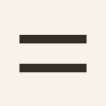

# Rhythm



Rhythm is a spacing system rooted in font metrics. Instead of fixed pixel modules like 8px, it uses the visual gap between lines of text—measured from one line’s x-height to the next baseline. This creates a responsive, typographically consistent spacing scale.

🔗 https://rhythm.lotva.ru/

## TLDR

```css
* {
	text-box: trim-both ex alphabetic;
}

:root {
	/* Baseline-to-baseline distance minus x-height */
	--gap: calc(1rlh - 1rex);
	--gap--relative: calc(1lh - 1ex);
}

p {
	margin-block-start: calc(var(--gap) * 2);
}

small + h1 {
	margin-block-start: var(--gap--relative);
}
```

By anchoring every spacing value to the font’s own metrics, the system adapts automatically. It scales across projects without manual setup; as soon as you define the line height, the rest of the layout falls into place.

Advantages:

**Simple mental model.** The minimum spacing around an element equals <nobr>`var(--gap)`</nobr>—the distance between its text lines.

**Responsive by design.** Spacing scales with font size and line height, making fluid typography simpler to manage.

**Typeface-aware.** When the font changes, spacing adjusts automatically to match its metrics.

## How to use

First, trim the text container to the visual bounds of the font:

```css
* {
	text-box: trim-both ex alphabetic;
}
```

Next, define the base gap—the visual gap between lines of text:

```css
:root {
	/* Root-relative: stays consistent across the document */

	--gap: calc(1rlh - 1rex);
}
```

Create a relative version that scales with the element’s font size:

```css
:root {
	/* Local-relative: scales with the element’s own lh/ex */

	--gap--relative: calc(1lh - 1ex);
}
```

Finally, build your spacing scale to fit the project’s needs:

```less
calc(var(--gap) * 0.5);
calc(var(--gap) * 0.75);
calc(var(--gap) * 1.5);
calc(var(--gap) * 2);
calc(var(--gap) * 3);
calc(var(--gap) * 4);
```

## Why it works

Most design systems define a _module_—a base unit, typically 8px, used to scale everything from font sizes to component dimensions. While a fixed module makes layout decisions predictable, spacing is the one area where this approach breaks down.

In practice, layout spacing is governed by font metrics—the unique, fractional measurements embedded in every typeface: the height of ascenders and descenders, the x‑height, and the built‑in line gap. When you set margins in CSS, the typeface adds its own spacing, which rarely aligns with a fixed 8px grid.

Additionally, the gaps between lines of text are determined by line height, a value chosen by the designer. Together, font metrics and line height create a system where the connection between a fixed module and actual text spacing is, at best, coincidental.

Rhythm introduces its own spacing module, derived directly from font metrics:

```css
:root {
	/* In font metrics, the visual gap equals: */
	/* ascent + descent + lineGap − xHeight */

	--gap: calc(1rlh - 1rex);
}
```

The visual gap between lines is the natural choice for a spacing unit. It’s the primitive designers already look to when balancing _the inner and the outer._

Typesetting follows a basic rule: inner ≤ outer. For a heading to look dignified, the gaps between words must exceed the gaps between letters, and the space between lines must exceed the space between words. The same logic applies to the entire layout: the space between elements should exceed the line spacing within them.

_See: [The rule of the inner and the outer](https://bureau.rocks/books/typography-en/6)_

For example:

- the space between a heading and its subline should be no smaller than the heading’s own visual gap,
- the margin between an illustration and a paragraph should be at least equivalent to the paragraph’s visual gap.

If the outer space is too small, elements invade each other’s personal space and the layout looks jammed. Increase the outer, and each element gains independence and architectural solemnity.

Rhythm formalizes this pattern by using the visual line gap as its primary module.

_See also: [Avoiding common layout mistakes using visual line gap](https://bureau.ru/soviet/20191002/) (Russian)_

## Browser support

This approach is made possible by modern CSS features: `text-box`, `rlh`, `lh`, and `rex`. Current browser support stands at approximately 81%, making it viable for most modern web applications.

For projects requiring wider compatibility, you can polyfill the `text-box` behavior using the [X-Size tool](https://lotva.ru/projects/xsize/).

## Use in PostCSS

```js
// postcss.config.cjs

const { gap, gapRelative } = require('./src/functions')

module.exports = {
	plugins: [
		require('postcss-functions')({
			functions: {
				gap,
				gapRelative,
			},
		}),
	],
}
```

<!-- prettier-ignore -->
```js
// functions.js

export const gap = (value = 1) => `calc(var(--gap) * ${value})`

export const gapRelative = (value = 1) => `calc(var(--gap--relative) * ${value})`
```

```css
/* Usage */

pre {
	padding: gap() gap(0.5) gap(2);
}
```

## Use in Tailwind

```scss
/* globals.tailwind.css */

@theme {
	/* Set the default spacing unit (e.g., m-1, p-4): */
	--spacing: var(--gap);

	/* Or define a fixed spacing scale: */
	--spacing-0.5g: calc(var(--gap) * 0.5);
	--spacing-0.75g: calc(var(--gap) * 0.75);
	--spacing-1g: var(--gap);
	--spacing-1.5g: calc(var(--gap) * 1.5);
	--spacing-2g: calc(var(--gap) * 2);
	--spacing-3g: calc(var(--gap) * 3);
	--spacing-4g: calc(var(--gap) * 4);
	--spacing-1gr: var(--gap--relative);
}
```

## Use in UnoCSS

The most flexible way to implement Rhythm is through a custom rule, allowing you to use dynamic multipliers (e.g., `mt-2.5g`):

```ts
// uno.config.ts

export default defineConfig({
	rules: [
		[
			/^(p|m|w|h|gap)(t|r|b|l|x|y|s|e|bs|be)?-([\d.]+)g(r)?$/,
			(match) => {
				const [, property, directive, n, relative] = match

				const gapProperty = relative ? '--gap--relative' : '--gap'
				const value = `calc(var(${gapProperty}) * ${n})`

				const baseMap = {
					p: 'padding',
					m: 'margin',
					w: 'width',
					h: 'height',
					gap: 'gap',
				} as const

				const base = baseMap[property as keyof typeof baseMap]
				if (!base) return

				const directiveMap: Record<string, string[]> = {
					'': [base],
					t: [`${base}-top`],
					r: [`${base}-right`],
					b: [`${base}-bottom`],
					l: [`${base}-left`],
					x:
						property === 'gap'
							? [base]
							: [`${base}-inline-start`, `${base}-inline-end`],
					y:
						property === 'gap'
							? [base]
							: [`${base}-block-start`, `${base}-block-end`],
					s: [`${base}-inline-start`],
					e: [`${base}-inline-end`],
					bs: [`${base}-block-start`],
					be: [`${base}-block-end`],
				}

				const properties = directiveMap[directive ?? '']
				if (!properties) return

				return Object.fromEntries(properties.map((p) => [p, value]))
			},
		],
	],
})
```

Alternatively, you can define a fixed spacing scale in your theme:

```ts
export default defineConfig({
	theme: {
		spacing: {
			'0.5g': 'calc(var(--gap) * 0.5)',
			'0.75g': 'calc(var(--gap) * 0.75)',
			'1g': 'var(--gap)',
			'1.5g': 'calc(var(--gap) * 1.5)',
			'2g': 'calc(var(--gap) * 2)',
			'3g': 'calc(var(--gap) * 3)',
			'4g': 'calc(var(--gap) * 4)',
			'1gr': 'var(--gap--relative)',
		},
	},
})
```

```html
<!-- Usage -->

<pre class="p-1g -m-0.5g mt-0.5g mbs-2gr gap-1g"></pre>
```
